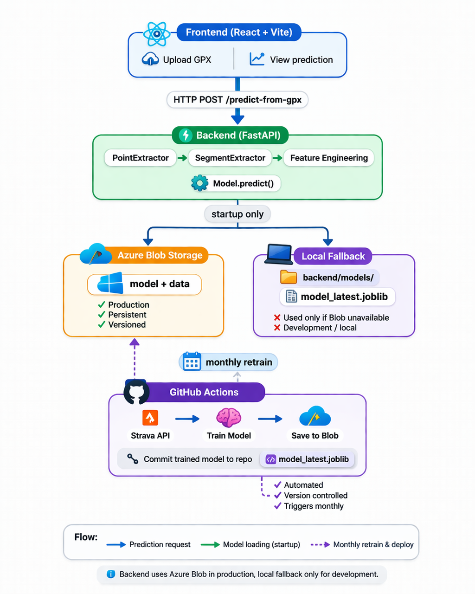

# Trail Running Time Predictor

Machine learning web application that predicts trail running race times from GPX files using segment-level regression trained on real Strava data.
Supports real-time inference via FastAPI and automated monthly retraining via GitHub Actions.

[](https://github.com/Iusztin-Bianca/trail-running-time-predictor/actions/workflows/monthly_training.yml)   


## Live Demo

**[trail-predictor.vercel.app](https://trail-predictor.vercel.app)**

Upload a `.gpx` file from a trail run or race and get a predicted finish time broken down by segment.

> Note: the backend runs on a free Render instance — the first request after inactivity may take ~50 seconds to wake up.

## Why This Project

This project combines my interest in endurance sports with machine learning, focusing on real-world performance prediction using GPX data.

## Tech Stack

| Layer | Technology |
|---|---|
| Frontend | React, TypeScript |
| Backend | FastAPI, Python 3.12 |
| ML | scikit-learn, Ridge Regression, XGBoost, SHAP |
| Storage | Azure Blob Storage |
| CI/CD | GitHub Actions |
| Hosting | Render (backend), Vercel (frontend) |

## Demo


## Architecture



## How It Works

### Inference (Prediction)
1. User uploads a GPX file
2. Route is split into segments (of maximum 1000m) by terrain type (uphill / downhill / flat)
3. For each segment, 17 features are extracted (gradient, distance, elevation, energy cost, etc.)
4. Model predicts time for each segment independently
5. Segment times are summed → total predicted race time

Instead of predicting total race time directly, the model predicts time at segment level and aggregates results.

### ML Pipeline
- **Training data**: personal activities from Strava application (trail runs with elevation ≥ 150m)
- **Approach**: segment-level regression — each segment is one training observation, dramatically increasing dataset size
- **Model**: Ridge Regression (chosen over XGBoost due to better generalization on small datasets)
- **Retraining**: automated monthly via GitHub Actions → new model saved to Azure Blob Storage + committed to repo as fallback

#### Feature importance (SHAP analysis - the 5 most significant features)**

| Rank | Feature | SHAP Value |
|---|---|---|
| 1 | `segment_energy_cost` | 101.6 — dominant predictor, captures combined gradient + distance cost |
| 2 | `elevation_loss_m` | 63.1 — descents significantly impact pace |
| 3 | `downhill_cost` | 26.1 — braking effort on steep descents |
| 4 | `elevation_gain_m` | 24.2 — climbing effort |
| 5 | `is_race` | 22.9 — race effort shifts pace considerably |

### Feature Engineering

Each segment is described by 17 features:

**Segment geometry**
| Feature | Description |
|---|---|
| `segment_distance_m` | Segment length in meters |
| `segment_time_sec` | Segment duration in seconds (target during training) |
| `segment_pace_mps` | Average pace in m/s |
| `cumulative_distance` | Total distance from activity start to end of segment |
| `cumulative_elevation` | Total elevation gain from activity start to end of segment |

**Elevation & gradient**
| Feature | Description |
|---|---|
| `elevation_gain_m` | Elevation gained within the segment (max(0, Δalt)) |
| `elevation_loss_m` | Elevation lost within the segment (max(0, -Δalt)) |
| `avg_gradient` | Mean gradient = Δelevation / segment_distance |
| `std_gradient` | Standard deviation of gradient in segment - measures terrain irregularity |
| `max_uphill_gradient` | Steepest uphill point (uphill segments only) |
| `max_downhill_gradient` | Steepest downhill point (downhill segments only) |
| `avg_elevation` | Mean altitude of the segment (affects air density / fatigue) |

**Effort type**
| Feature | Description |
|---|---|
| `is_race` | 1 if predicting a race effort, 0 otherwise |
| `is_easy` | 1 if predicting a recovery run, 0 otherwise |

**Biomechanical cost**
| Feature | Formula | Description |
|---|---|---|
| `uphill_cost` | `distance × (1 + 6 × gradient)` | Extra effort penalty for climbing |
| `downhill_cost` | `distance × (1 + 6 × \|gradient\|)` | Braking effort penalty for descending |
| `segment_energy_cost` | Minetti formula | Metabolic energy cost (J/kg) per segment |

The Minetti formula models the metabolic cost of running on a slope:

$$E = (155.4g^5 - 30.4g^4 - 43.3g^3 + 46.3g^2 + 19.5g + 3.6) \times d$$

where `g` is the signed gradient (positive = uphill, negative = downhill) and `d` is segment distance in meters.

### Model Evaluation

#### Why Ridge over XGBoost?

Both models were tuned via **grid search with TimeSeriesSplit cross-validation** to find the optimal hyperparameters (Ridge: `alpha`; XGBoost: `learning_rate`, `max_depth`, `n_estimators`, `min_child_weight`).

The dataset covers a wide variety of races — from short technical mountain runs to long ultra-trails — which introduces high variance in activity duration and terrain profile. 

Despite XGBoost showing better training metrics, Ridge consistently achieves lower test MAE and MAPE — a sign that XGBoost **overfits** on the small dataset even after tuning (as seen by the gap between train and test metrics).

Ridge, being a regularized linear model, generalizes better across this diverse range of activities.

Trained on **68 activities** and **2,565 segments** (segment-level regression multiplies the effective dataset size ~38x per activity).

| Model | Test MAE | Test MAPE | Test R² |
|---|---|---|---|
| **Ridge** ✓ | **503s** | **7.0%** | **0.972** |
| XGBoost | 626s | 9.2% | 0.962 |

> Last updated: March 2026. Current metrics are always available in app/ml/evaluation/model_draft_comparison.json.

As the dataset grows over time with more monthly training runs, XGBoost is expected to eventually outperform Ridge — tree-based models typically benefit more from larger datasets.

## Performance

Prediction latency is dominated by **GPX parsing and feature extraction**, not model inference — Ridge is a linear model and predicts in milliseconds regardless of route length.

| Step | Approximate time |
|---|---|
| GPX parsing & segmentation + feature extraction(per segment) | 1-2s |
| Model inference (all segments) | < 30ms |
| **Total (typical GPX file)** | **~1–3s** |

Initial profiling showed 7–8s response times for long races. This was reduced to under 3s through **GPX downsampling** (reducing point density before parsing) and **vectorized feature extraction** (replacing per-segment loops with numpy operations).

The model is loaded once at startup and kept in memory — there is no per-request loading overhead.

## Limitations

- **Small dataset**: trained on one athlete's Strava activities — predictions may be less accurate for runners with very different profiles (predictions reflect that runner's fitness and style)
- **No weather, technical terrain or fatigue modeling**: conditions like heat, wind, rain, rocky terrain or accumulated fatigue are not captured
- **GPX quality**: accuracy depends on GPS signal quality and elevation data in the uploaded file

## Future Improvements

- Collect more training data to improve generalization
- Add terain features (rocks, scrambling sections)
- Model fatigue explicitly ( ex: volume of training in the week before the race)
- Support multi-runner profiles or user-specific calibration


## Project Structure

```
trail-running-time-predictor/
├── app/                          # Core ML package (shared by backend & scripts)
│   ├── config/                   # Settings (env vars via Pydantic)
│   ├── data_ingestion/           # Strava API client & data pipeline
│   ├── feature_engineering/      # GPX parsing & segment feature extraction
│   └── ml/
│       ├── config/               # Model hyperparameters (Ridge, XGBoost)
│       ├── data/                 # Blob Storage manager & data splitting
│       ├── evaluation/           # Metrics calculation
│       ├── models/               # Ridge & XGBoost wrappers
│       └── services/             # Trainer, predictor, hyperparameter tuner
├── backend/
│   ├── app/
│   │   ├── routes/               # FastAPI endpoints (/predict-from-gpx, /health)
│   │   ├── schemas/              # Pydantic request/response models
│   │   └── main.py               # App entry point & model loading
│   ├── models/                   # Local model fallback (model_latest.joblib)
│   └── requirements.txt
├── frontend/                     # React + TypeScript + Vite
├── scripts/
│   └── monthly_training.py       # Retraining script (runs via GitHub Actions)
├── .github/workflows/
│   └── monthly_training.yml      # Automated monthly retraining CI/CD
└── pyproject.toml
```

## Local Setup

### Prerequisites
- Python 3.12
- Node.js 20+
- Docker (optional)

### 1. Clone the repository
```bash
git clone https://github.com/Iusztin-Bianca/trail-running-time-predictor.git
cd trail-running-time-predictor
```

### 2. Backend

```bash
cd backend
python -m venv venv
```

#### Windows
```bash
venv\Scripts\activate
```
#### Linux/Mac
```bash
source venv/bin/activate
pip install -r requirements.txt
```

Start the backend: 
```bash
uvicorn app.main:app --reload
```

Note: No credentials needed to run the app — the pre-trained model is included at backend/models/model_latest.joblib and loaded automatically.

Note: Strava and Azure credentials are only required if you want to retrain the model on your own Strava data.

### 3. Frontend
```bash
cd frontend
npm install
npm run dev
```

### Retraining on your own data (optional)
To retrain the model on your own Strava activities, create a `.env` file in the root directory with:
- STRAVA_CLIENT_ID=your_client_id
- STRAVA_CLIENT_SECRET=your_client_secret
- STRAVA_REFRESH_TOKEN=your_refresh_token
- AZURE_STORAGE_CONNECTION_STRING=your_connection_string
- Then run `python scripts/monthly_training.py`.

## License

MIT License — feel free to use, fork, and adapt this project.


